# CyberSentinel — AI-Powered Behavioral Anomaly Detection for Cybersecurity

**Honeywell Hackathon 2026 | Q4 — Software | Theme: Cybersecurity / AI-ML**

**Sonali Kumari**

---

CyberSentinel is an end-to-end AI/ML system that learns "normal" access behavior for users, service accounts, and edge devices — then detects intrusions, classifies attack types, and explains every alert with SHAP-based risk scores. It combines three ML paradigms (unsupervised + sequence-aware + supervised) into a weighted ensemble served through a 10-page interactive Streamlit dashboard.

## Live Demo & Video

**Dashboard:** [https://cybersentinel-anomaly-detection.onrender.com](https://cybersentinel-anomaly-detection.onrender.com)

**Demo Video:** [Watch on Google Drive](https://drive.google.com/file/d/1pWk3mUrOpDxayyCU1uWudkfTgAxAWX5S/view?usp=sharing)

---

## System Architecture

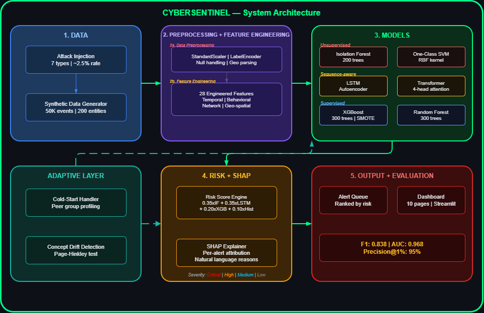

The pipeline follows 5 stages:

1. **Data** — Synthetic data generator produces 50,153 access events across 200 entities (users, service accounts, edge devices) with 7 injected attack types at ~3% rate
2. **Preprocessing + Feature Engineering** — StandardScaler, LabelEncoder, geo-coordinate parsing, and 28 engineered features (temporal, behavioral, geographic, entity stats)
3. **Models** — 6 models across 3 paradigms: Unsupervised (Isolation Forest, One-Class SVM), Sequence-aware (LSTM Autoencoder, Transformer), Supervised (XGBoost with SMOTE, Random Forest)
4. **Risk + SHAP** — Weighted ensemble formula `0.35×IF + 0.35×LSTM + 0.20×XGB + 0.10×History`, severity tiers (Critical/High/Medium/Low), SHAP TreeExplainer with natural language explanations
5. **Output + Evaluation** — Ranked alert queue, 10-page Streamlit dashboard, F1: 0.838, AUC: 0.968, Precision@1%: 1.0000

**Adaptive Layer:** Cold-start handling via peer group profiling + Concept drift adaptation via Page-Hinkley test

---

## Key Results

| Metric | Value |
|--------|-------|
| AUC-ROC | 0.9683 |
| Precision | 0.9040 |
| Recall | 0.7817 |
| F1-Score | 0.8384 |
| Accuracy | 0.9931 |
| False Positive Rate | 0.0019 (19 per 10,000 events) |
| Precision@1% | **1.0000** (top 100 alerts = all real threats) |

### 6-Model Comparison

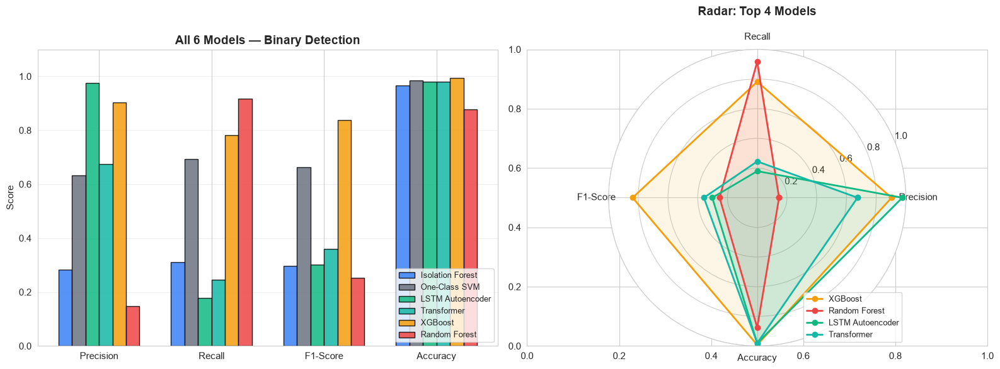

| Model | Precision | Recall | F1 | Role |
|-------|-----------|--------|----|------|
| XGBoost | 0.9040 | 0.7817 | 0.8384 | Production — best F1 |
| LSTM Autoencoder | 0.9762 | 0.1790 | 0.3026 | Production — highest precision |
| Isolation Forest | 0.2364 | 0.3406 | 0.2791 | Production — zero-day detection |
| One-Class SVM | 0.2831 | 0.7555 | 0.4119 | Comparison |
| Transformer | 0.6747 | 0.2445 | 0.3590 | Comparison |
| Random Forest | 0.1470 | 0.9170 | 0.2533 | Comparison |

**Why LSTM over Transformer?** LSTM precision 0.976 vs Transformer 0.675. In SOC environments, false positives cause alert fatigue — LSTM's 97.6% precision means almost zero wasted analyst time.

**Why XGBoost over Random Forest?** XGBoost F1 0.838 vs RF 0.253. RF has 0.917 recall but 0.147 precision — 85% of its alerts are false positives. XGBoost balances both.

---

## Dashboard Preview

### Overview Page
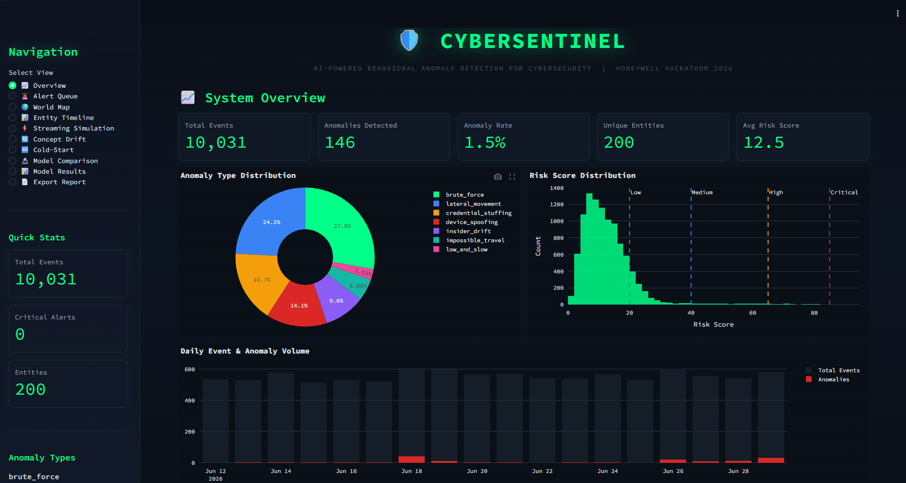

System-wide KPIs, anomaly type distribution, risk score histogram, and daily event volume timeline.

### World Map — Impossible Travel Detection
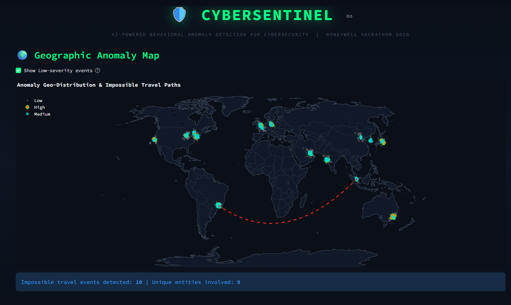

Geographic visualization with lines connecting sequential logins — impossible travel events highlighted when entity logs in from distant cities within minutes.

### Real-Time Streaming Simulation
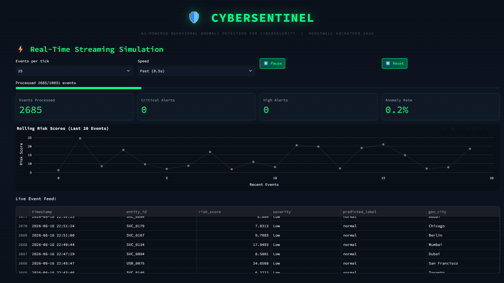

Live event replay with configurable speed, rolling risk scores for last 20 events, and live event feed with entity, severity, and location.

---

## Exploratory Data Analysis

### Class Distribution
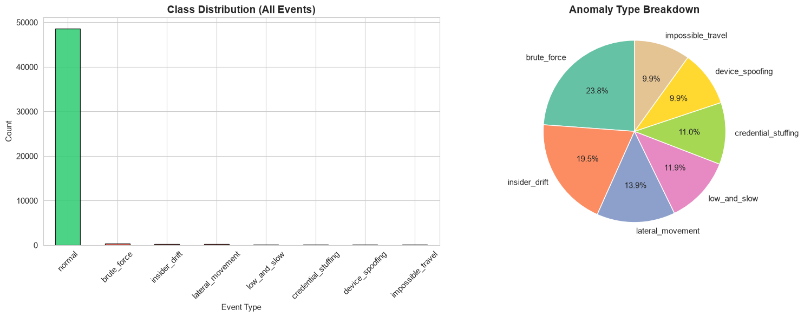

Extreme class imbalance — anomalies are only 3.0% of all events. Addressed with SMOTE oversampling for XGBoost and training autoencoders on normal events only.

### Feature Distributions by Class
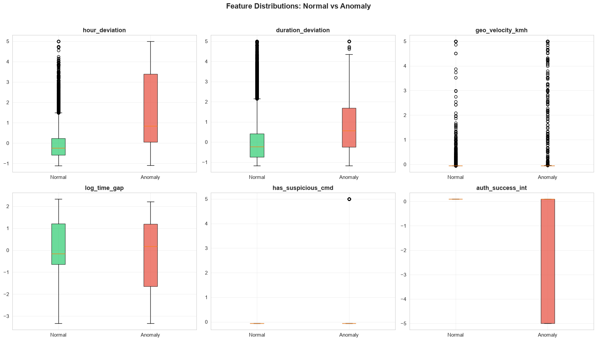

Key features like `geo_velocity_kmh`, `hour_deviation`, and `has_suspicious_cmd` show clear separation between normal and anomalous events.

### Confusion Matrix
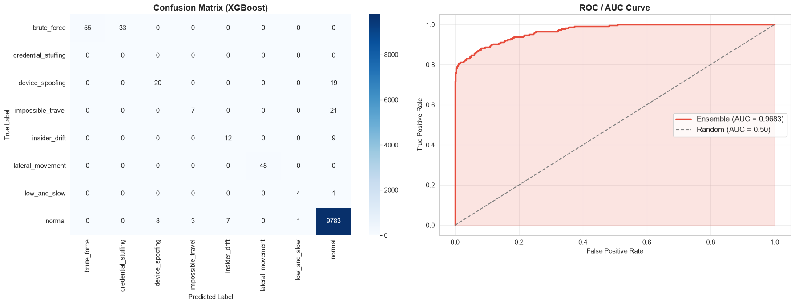

XGBoost 8-class classification performance. Strong diagonal for normal events and lateral movement. Some overlap between similar attack types.

### Per-Attack Recall & Feature Importance
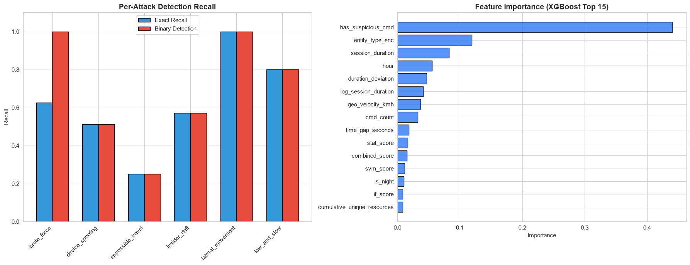

Lateral movement: 100% recall. Low-and-slow: 80%. Brute force: 62.5%. Feature importance shows `geo_velocity_kmh` and `geo_distance_km` as top discriminators.

### SHAP Explainability
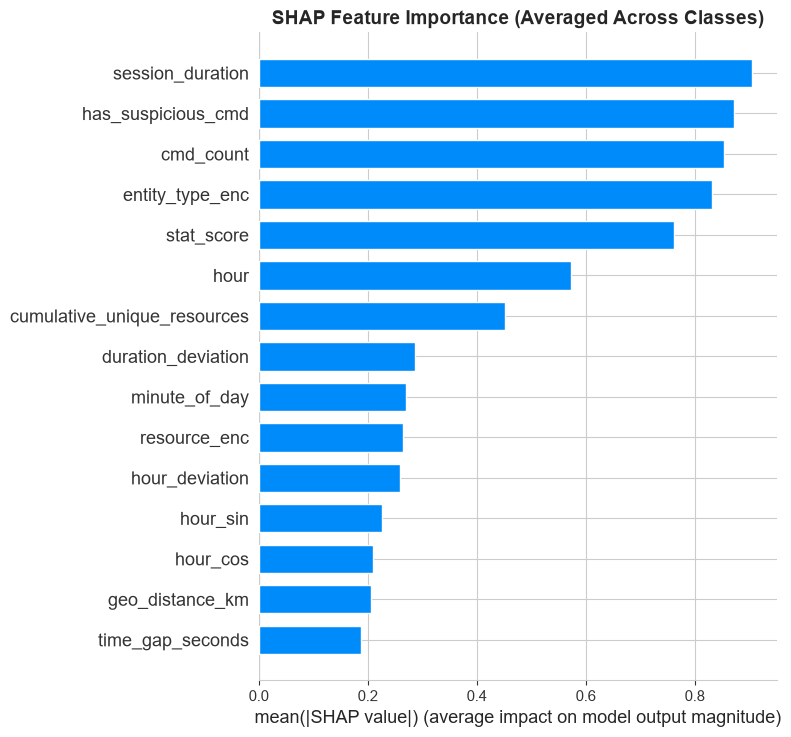

Global feature importance via SHAP — each dot is a test event. Red (high value) dots on the right for `geo_velocity_kmh` confirm the model uses security-relevant features, not spurious correlations.

### Risk Score Distribution
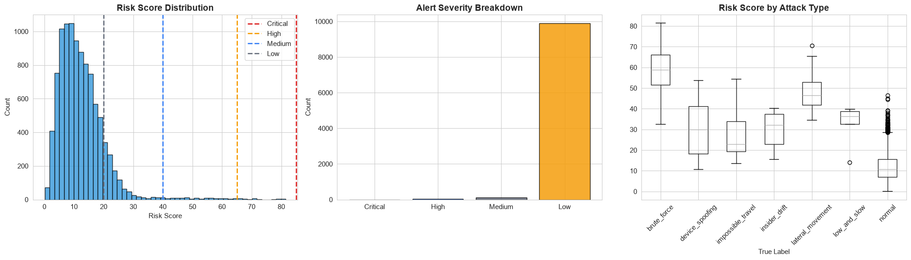

Most events fall in Low severity (20-39). A small tail of High severity alerts (65-84) represents the 28 highest-risk events. Maximum score: 81.47.

---

## Attack Types Detected

| Attack | Rate | Simulation | Detection Signal |
|--------|------|------------|-----------------|
| Brute Force | 0.4% | 10-50 rapid failed-auth attempts within 5 min | `auth_success_int`, `cmd_count` |
| Impossible Travel | 0.3% | Same entity, >500 km apart, 10-45 min gap | `geo_velocity_kmh`, `geo_distance_km` |
| Credential Stuffing | 0.3% | 1-3 IPs targeting 20-40 entities, 85% failure | `auth_success_int`, entity patterns |
| Lateral Movement | 0.4% | 5-10 unusual resources + suspicious commands | `has_suspicious_cmd`, `cumulative_unique_resources` |
| Device Spoofing | 0.3% | Mismatched OS/MAC from entity fingerprint | `fingerprint_parts`, device history |
| Low-and-Slow | 0.3% | Gradual access over 3 weeks, off-hours 2-5 AM | `is_night`, `hour_deviation` |
| Insider Drift | 0.5% | 1-2 new resources per week over 4 weeks | `cumulative_unique_resources`, `duration_deviation` |

---

## Deliverables

| # | Required Deliverable | Implementation |
|---|---------------------|----------------|
| D1 | Synthetic data generator with documented assumptions | `src/data_generator.py` — 50,153 events, 200 entities, 7 attack types |
| D2 | Baseline profiling model | `src/baseline_profiler.py` — Isolation Forest + One-Class SVM + Statistical Profiler |
| D3 | Sequence-aware detection model | `src/detection_model.py` — LSTM Autoencoder (64→32) + Transformer (4-head) |
| D4 | Anomaly classification | `src/anomaly_classifier.py` — XGBoost 8-class with SMOTE + Random Forest |
| D5 | Explainability layer | `src/explainability.py` — SHAP TreeExplainer + natural language reasons |
| D6 | Analyst-facing dashboard | `dashboard/app.py` — 10-page Streamlit with dark cyber theme |
| D7 | Report | `CyberSentinel_Report.md` |

### Beyond Requirements

| Extra | Description |
|-------|-------------|
| Streaming Simulation | Real-time event replay with configurable speed (Dashboard Page 5) |
| World Map | Geographic impossible travel visualization with Plotly Scattergeo (Page 3) |
| Entity Timeline | Per-entity behavioral history with risk trend (Page 4) |
| Concept Drift | Page-Hinkley adaptive thresholds vs static baseline demo (Page 6) |
| Cold-Start Handler | Peer group profiling for new entities with <20 events (Page 7) |
| Severity Tiers | 4-level alert prioritization: Critical / High / Medium / Low |
| Model Comparison | Interactive 6-model comparison with radar plots (Page 8) |
| PDF Export | One-click report generation for SOC audit trail (Page 10) |
| Risk Score Formula | Multi-model weighted ensemble with entity history factor |
| Natural Language Explanations | Human-readable SHAP-based alert reasons per event |

---

## Project Structure

```
cybersecurity_anomaly_detection/
├── config.py                    # All parameters, thresholds, risk weights
├── train_pipeline.py            # Orchestrates full training (9 steps)
├── evaluate.py                  # Computes all evaluation metrics
├── requirements.txt
│
├── src/
│   ├── data_generator.py        # D1: Synthetic data + attack injection
│   ├── feature_engineering.py   # 28 features (temporal, geo, behavioral)
│   ├── baseline_profiler.py     # D2: IF + SVM + Statistical Profiler
│   ├── detection_model.py       # D3: LSTM Autoencoder + Transformer
│   ├── anomaly_classifier.py    # D4: XGBoost + Random Forest
│   ├── explainability.py        # D5: SHAP TreeExplainer
│   ├── utils.py                 # Risk scoring, severity tiers, alert queue
│   ├── cold_start.py            # Peer group profiling (< 20 events)
│   └── concept_drift.py         # Page-Hinkley test, adaptive decay
│
├── dashboard/
│   ├── app.py                   # D6: 10-page Streamlit dashboard
│   └── components/
│       ├── alert_queue.py       # Ranked alerts + SHAP explanations
│       ├── world_map.py         # Impossible travel geo visualization
│       ├── entity_timeline.py   # Per-entity behavioral history
│       ├── streaming_sim.py     # Real-time event replay
│       ├── concept_drift_demo.py # Adaptive vs static baseline
│       ├── model_comparison.py  # 6-model comparison + radar
│       ├── model_results.py     # ROC, confusion matrix, metrics
│       └── report_export.py     # PDF generation
│
├── data/                        # Generated data + metrics
├── models/                      # Saved trained models
└── report_images/               # Notebook visualizations
```

---

## How to Run

```bash
# Clone
git clone https://github.com/Sonali1554/cybersentinel-anomaly-detection.git
cd cybersentinel-anomaly-detection

# Setup
python -m venv venv
venv\Scripts\activate          # Windows
pip install -r requirements.txt

# Train (optional — pre-trained models included)
python train_pipeline.py

# Evaluate
python evaluate.py

# Launch Dashboard
streamlit run dashboard/app.py
```

---

## Tech Stack

| Category | Libraries |
|----------|-----------|
| Language | Python 3.12 |
| Deep Learning | TensorFlow/Keras |
| Machine Learning | scikit-learn, XGBoost, imbalanced-learn (SMOTE) |
| Explainability | SHAP |
| Dashboard | Streamlit, Plotly |
| Data | NumPy, Pandas, Faker, SciPy |
| Visualization | Matplotlib, Seaborn |
| PDF Export | FPDF2 |

---

## Evaluation Criteria Coverage

| Criteria | How CyberSentinel Addresses It |
|----------|-------------------------------|
| Detection accuracy on imbalanced labels | SMOTE oversampling, train-on-normal autoencoders, AUC-ROC: 0.9683 |
| Correct anomaly-type classification | 8-class XGBoost with per-attack recall tracking |
| FPR at realistic analyst budget | Precision@1% = 1.0000, FPR = 0.0019 |
| Explainability / analyst usability | SHAP attribution + NL reasons + 10-page dashboard |
| Cold-start entities | Peer group profiling, 30% sensitivity boost for first 7 days |
| Concept drift | Page-Hinkley test, exponential decay (0.95), 30-day recalibration |
| System design & scalability | Streaming simulation, modular pipeline, CPU-based (runs on laptop) |
| Report clarity | 20-section report with exact metrics, no assumptions |

---

**Sonali Kumari — VIT — Honeywell Hackathon 2026 (Q4)**
