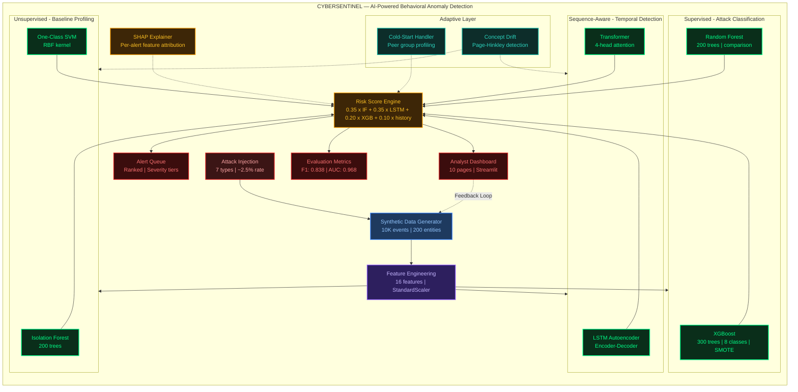

```mermaid
flowchart TD
    subgraph SYSTEM["CYBERSENTINEL — AI-Powered Behavioral Anomaly Detection"]
        direction TB

        %% ── DATA LAYER ──
        ATK["Attack Injection\n7 types | ~2.5% rate"] --> A
        A["Synthetic Data Generator\n10K events | 200 entities"] --> B["Feature Engineering\n16 features | StandardScaler"]

        %% ── MODELS ──
        B --> UNSUPERVISED
        B --> SEQUENCE
        B --> SUPERVISED

        subgraph UNSUPERVISED["Unsupervised - Baseline Profiling"]
            IF["Isolation Forest\n200 trees"]
            SVM["One-Class SVM\nRBF kernel"]
        end

        subgraph SEQUENCE["Sequence-Aware - Temporal Detection"]
            LSTM["LSTM Autoencoder\nEncoder-Decoder"]
            TRANS["Transformer\n4-head attention"]
        end

        subgraph SUPERVISED["Supervised - Attack Classification"]
            XGB["XGBoost\n300 trees | 8 classes | SMOTE"]
            RANDF["Random Forest\n200 trees | comparison"]
        end

        %% ── RISK SCORING ──
        IF --> RISK
        SVM --> RISK
        LSTM --> RISK
        TRANS --> RISK
        XGB --> RISK
        RANDF --> RISK

        RISK["Risk Score Engine\n0.35 x IF + 0.35 x LSTM + 0.20 x XGB + 0.10 x history"]

        SHAP["SHAP Explainer\nPer-alert feature attribution"] -.-> RISK

        %% ── OUTPUT ──
        RISK --> AQ["Alert Queue\nRanked | Severity tiers"]
        RISK --> DASH["Analyst Dashboard\n10 pages | Streamlit"]
        RISK --> EVALM["Evaluation Metrics\nF1: 0.838 | AUC: 0.968"]

        %% ── ADAPTIVE ──
        subgraph ADAPT["Adaptive Layer"]
            CS["Cold-Start Handler\nPeer group profiling"]
            CD["Concept Drift\nPage-Hinkley detection"]
        end

        CS -.-> RISK
        CD -.-> SEQUENCE
        CD -.-> UNSUPERVISED

        %% ── FEEDBACK ──
        DASH -.->|Feedback Loop| A
    end

    %% ── STYLES ──
    classDef data fill:#1e3a5f,stroke:#3B82F6,color:#93C5FD,stroke-width:2px
    classDef feature fill:#2d1f5e,stroke:#8B5CF6,color:#C4B5FD,stroke-width:2px
    classDef model fill:#0a2e1a,stroke:#00FF88,color:#00FF88,stroke-width:2px
    classDef risk fill:#3d2607,stroke:#F59E0B,color:#FBBF24,stroke-width:2px
    classDef output fill:#3b0d0d,stroke:#DC2626,color:#F87171,stroke-width:2px
    classDef adaptive fill:#0d2d2a,stroke:#14B8A6,color:#2DD4BF,stroke-width:2px
    classDef attack fill:#3b1515,stroke:#DC2626,color:#FCA5A5,stroke-width:2px

    class A data
    class ATK attack
    class B feature
    class IF,SVM,LSTM,TRANS,XGB,RANDF model
    class RISK,SHAP risk
    class AQ,DASH,EVALM output
    class CS,CD adaptive
```
